# Shiny app for exploration of single Cell data


- [Shiny app for exploration of single Cell data](#shiny-app-for-exploration-of-single-cell-data)
  * [Trello board:](#trello-board-)
  * [Installation:](#installation-)
  * [Running the app](#running-the-app)
  * [User guide](#user-guide)
    + [Introduction](#introduction)
    + [Gene and Cell selection](#gene-and-cell-selection)
      - [Cell selection](#cell-selection)
      - [Gene selection](#gene-selection)
    + [CellRangerTools](#cellrangertools)
      - [pheatmap](#pheatmap)
    + [Co-expression](#co-expression)
      - [All clusters](#all-clusters)
      - [Selected](#selected)
      - [binarized](#binarized)
      - [Co-expression Violin plot](#co-expression-violin-plot)
    + [Data Exploration](#data-exploration)
      - [Expression](#expression)
      - [Panel plot](#panel-plot)
      - [Scater QC](#scater-qc)
    + [General QC](#general-qc)
      - [UMI histogram](#umi-histogram)
      - [Sample histogram](#sample-histogram)
      - [PC variance](#pc-variance)
      - [tSNE plot](#tsne-plot)
    + [Subcluster analysis](#subcluster-analysis)
      - [DGE analysis](#dge-analysis)
    + [Side panel](#side-panel)
  * [Description of repository](#description-of-repository)
  * [Development guide](#development-guide)
    + [components/plug-ins](#components-plug-ins)
    + [Modules](#modules)
      - [conventions used here.](#conventions-used-here)
    + [tool tips](#tool-tips)
    + [compute image for heavy computations](#compute-image-for-heavy-computations)
    + [reports from contributions / plugins](#reports-from-contributions---plugins)

<small><i><a href='http://ecotrust-canada.github.io/markdown-toc/'>Table of contents generated with markdown-toc</a></i></small>


This is a shiny / RStudio app for the exploration and analysis of single cell RNAseq data as it comes from 10X or MARSseq technologies. It is currently being developed based on user requests of the Cytometry and Biomarkers UTechS at the Pasteur Institute, Paris. The goal is to enable the users of our platform to explore their data, select cells they would like to work with and then perform the final analysis together with the bioinformatics support here at Pasteur.

The original version of this app is CellView (https://github.com/mohanbolisetty/CellView), but it was substantially modified. It helped me get started.

## Trello board:

 https://trello.com/b/aZ4iLvAA
 
 Here, I organize the development tasks of the application. Could probably also be done within Gitlab, but I am more used to working with Trello...
 There are also a lot of "TODO" items in the code that need to be worked on...
 
## Installation:

Download git repository from gitlab/github (https://gitlab.pasteur.fr/hub/scShinyHub (need account for this one) or https://github.com/baj12/scShinyHub (public more stable version)).
  In RStudio create a new project (version control, git)
  
I needed to have TCL/TK installed to be able to install the sm package.

```R
requiredPackages= c("psych", "scran", "shiny", "shinyTree", "plotly", "shinythemes", "ggplot2", "DT", 
"pheatmap", "threejs", "sm", "RColorBrewer", "mclust", "reshape",  "knitr", "kableExtra", "shinyWidgets", "scater", "biomaRt", "devtools", "dplyr", "edgeR", "gplots", "shinydashboard", "stringi", "svglite")
install.packages(c("rafalib", "shinydashboard", "shinyBS", "shinythemes", "Rfast", "shinycssloaders", "pryr", "scran"))
rafalib::install_bioc(requiredPackages)
devtools::install_github("mul118/shinyMCE")
devtools::install_github("jlmelville/uwot")
BiocManager::install("TRONCO")

install.packages("sm")
```

https://support.10xgenomics.com/single-cell-gene-expression/software/pipelines/latest/rkit

need to have gfortran installed as well

## Running the app

Simply open the file server.R in RStudio and click the Run button in RStudio.

## User guide

(Images can be enlarged by clicking on them)

### Introduction

This package should allow a non-bioinformatician to work with single cell data. I.e. with the counts that have been created after aligning and mapping of sequenced reads to the genes of the reference genome. It is (for now) also required to create the input data as a preformatted RData/Rds files. (Examples are provided in reformatExamples.R). For this User guide I am using a public data set of PBMC single cell RNAseq data (https://doi.org/10.1101/123810).

[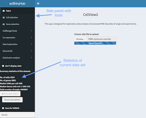](images/screen1large.png)

### Gene and Cell selection

A key feature of this app is the ability to change the cells and genes that are being used for the rest of the app. 

Note: The calculation of the statistics can be quite long and disrupt working with these two panels. To avoid this calculation and speed up the selection process one can activate the "don't display stats" check box, which should be unselected again after the selection is finished.

#### Cell selection

[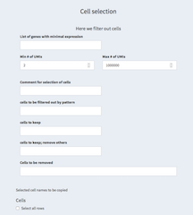](images/cellSelection1large.png)<br/>
[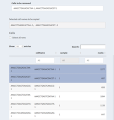](images/cellSelection2large.png)

* **List of genes with minimal expression**

A list of genes with minimal expression can be defined here. Cells must have at least one of these genes expressed with at least one read.

* **Min # of UMIs / Max # of UMIs**

Set the minimum/maximum number of UMIs per cell. See also General QC - UMI histogram

* **Comment for selection of cells**

The comment text here can be used in the reports to annotate the reasoning for the particular selection of cells.

* **cells to be filtered out by pattern**

A regular expression can be used to filter out cells. For example, 

* **cells to keep**

We can select cells that we want to explicitly keep. This overwrites the filter from "cells to be filtered out by pattern" and "Cells to be removed".

* **cells to keep; remove others**

Here we restrict ourselves to cells that should be kept removing anything else. You could for example decide to work only with one t-SNE cluster and select the cell for that cluster from the "General QC - TSNE plot" panel. This overwrites all other filters except the min/max UMI expression constrains.

* **Cells to be removed**

Specify individual cells that should be removed.

* **Selected cell names to be copied**

Cells selected in the table below that have been selected. 

* **Cells**

Table with all cells. These are all cells without any filter applied. Though, one can  apply filters directly in the table by setting thresholds in the number of ngenes for examples.

It is also possible to select cells by clicking on them. They will then be listed underneath "Selected cell names to be copied" and can be copy/pasted to other places.

** **Select all rows**

Using this check box one can select all cells with the filter from the table applied thus filling up the "Selected cell names to be copied" with the cell names.

** Comments

Because selecting the right cells can become very complicated it might be a good idea to have a separate document open where selections of cells and genes can be copied to and annotated. This would be apart from this application.

#### Gene selection

To speed up the selection process it is recommended to disable the summary statistics by selecting "don't display stats". This will disable the calculations and allow for a faster selection process.

[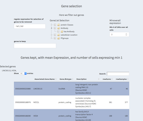](images/selectedGenes1large.png)<br/>
[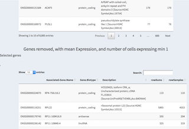](images/selectedGenes2large.png)


* **regular expression for selection of genes to be removed**

Genes can be removed based on their "Associated.Gene.Name" by a regular expression. Thus, "^MT" will remove any gene starting with (^) the two characters "MT". Usually these are mitochondrial genes that start with these characters. Similarily some ribosomol proteins start with the letters "RP". Both can be combined with OR symbol (|).

* **GeneList Selection**

There are some predefined classes of genes. By selecting one class other genes are removed. 

* **Minoverall expression**

Only genes with at least as many UMIs as selected here will be kept. We use the sum over all cells and not per cell counts.

* **genes to keep**

Genes that have been removed using the regular expression or otherwise can be forced into the list of used genes using this parameter. Please check in the tables below the results of your actions.

* **Genes kept table**

Here the genes used for the analysis are kept.

* **Selected genes**

By clicking on a row you can select genes, these are then being displayed above and can be copy/pasted elsewhere.

* **Genes removed table**

Genes that have been removed from the current selection are listed here. Again, genes can be selected by clicking on them and are displayed above the table for copy/paste purposes.

### CellRangerTools

Some of the functionality from the CellRanger package has been integrated. Notably 

#### pheatmap

[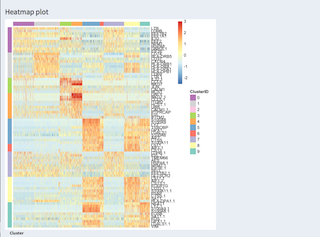](images/pheatmap1large.png) <br/>
[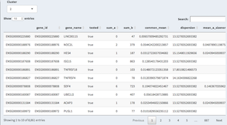](images/pheatmap2large.png)
[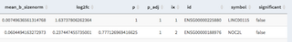](images/pheatmap3large.png)

A heatmap of expression (color code) of genes (rows) and cells (columns) are shown. We are using the CellRanger R package to calculate this. The table below shows the genes that are differentially expressed for a given cluster (can be changed with the drop-down)


### Co-expression

Several visualizations are available to investigate the co-expression of specified genes in different contexts.

#### All clusters

Given a comma separated list of genes the expression heatmap of these genes is shown. The sample and tSNE cluster association is also shown.

[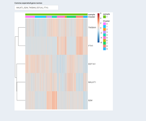](images/coexpressionAll1large.png) 


#### Selected

Based on a given two-dimensional projection the co-expression heatmap is displayed on a selection of cells. The selection is done using the mouse in the 2D plot.


[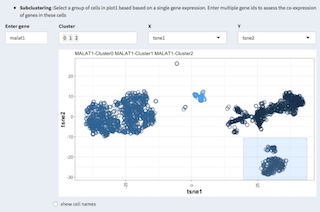](images/coexpressionSelected1large.png) <br/>
[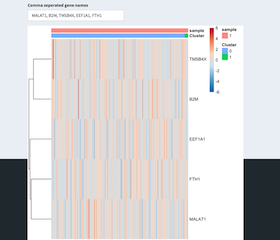](images/coexpressionSelected2large.png)


#### Co-expression Violin plot

Violin plot: for each cell we count how many of the genes specified have an expression larger or equal than the minimum expression.
These counts are then divided up for any variable that can be used as a factor (has less than 20 levels).
                                 

[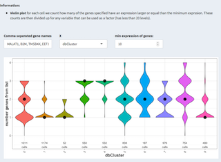](images/coexpressionViolin1large.png) 


### Data Exploration

Visualization under Data Exploration allow for analyzing individual genes or groups of genes.

#### Expression

3D and 2D representation of the expression of a single gene. A violin plot shows the expression of that gene per tSNE cluster.

[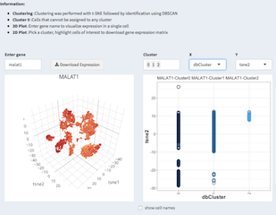](images/dataExplorationExpression1large.png) <br/>
[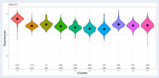](images/dataExplorationExpression2large.png)


#### Panel plot

In the panel plot we can visually compare individual genes on for one or all clusters projected on two dimensions.

[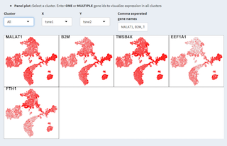](images/dataExplorationPanelPlot1large.png)


#### Scater QC

From the scater package: Plot of the 20 most highly expressed features (computed according to the highest total read counts) across all cells in the dataset. For each feature, the circle represents the percentage of counts across all cells that correspond to that feature. The features are ordered by this value. The bars for each feature show the percentage of counts corresponding to the feature in each individual cell, providing a visualization of the distribution across cells. (doi: 10.1093/bioinformatics/btw777).

This is computationally VERY expensive!

[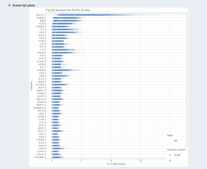](images/dataExplorationScaterQC1large.png)


### General QC

#### UMI histogram

Showing a histogram of UMIs per cell (hist(colSums(expression)), columns are cells, expression are reads (UMIs) per gene).

[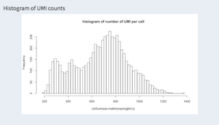](images/generalQCUMIHistogram1large.png)

#### Sample histogram

When working with different samples their distribution can be shown here. The example has only one experiment.

[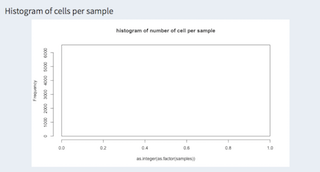](images/generalQCSampleHistogram1large.png)


#### PC variance

Showing the first ten components of the PCA.

[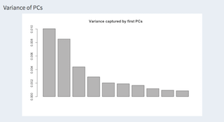](images/generalQCPCVariance1large.png)

#### tSNE plot

t-SNE calculation and parameters can be set here. There is also the possibility to select certain cells and copy/paste them to the cell selection panel. It is using the actual working cells and genes after filtering applied through the cell / gene selection panels.

[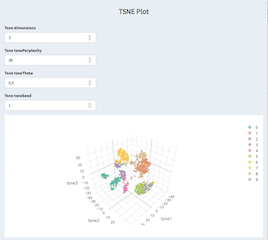](images/generalQCTSNE1large.png) <br/>
[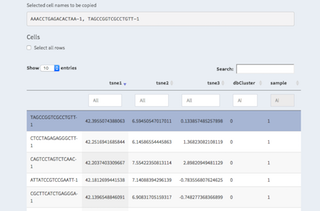](images/generalQCTSNE2large.png)


### Subcluster analysis

#### DGE analysis

Basic differential gene expression analysis (see (https://doi.org/10.1101/123810) for further details). Log2 normalized data is applied to a likelyhood test. The idea here is not to provide a soficticated differential gene expression analysis but rather help identifying genes and cell of interest that would afterwards used for an in-depth analysis, using for example Pagoda2 or equivalent.

[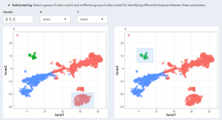](images/subclusterDGE1large.png) <br/>
[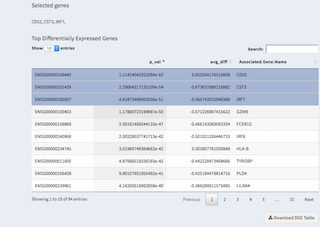](images/subclusterDGE2large.png)


### Side panel

The side panel shows, apart from the different panels describe above, the summary stastics of the data set after applying the cell/gene filters.

There is a button called "Generate report" that allows to generate an HTML report with the selections done previously. 

"Force calculations" executes all the time consuming calculations at once allowing for a one-time wait compared to having to wait for each panel. 

The "Save for DEBUG" check box saves intermediate states within the app that can be later used for debugging purposes. The current value is displayed below.

[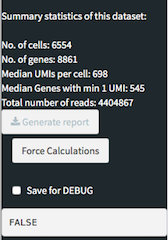](images/sidebar1large.png)


## Description of repository

* contributions
  User contributions can be implemented here. Files like ui.R, server.R are being read by the ui.R and server.R files in the root directory. See "Development guide" for further information.
  
* aad0501_Table_S3.xlsx
  Excel file with cell type specific genes (from: Dissecting the multicellular ecosystem of metastatic melanoma by single-cell RNA-seq)
  http://science.sciencemag.org/content/suppl/2016/04/07/352.6282.189.DC1

* Examples
  directory containing example data coming from the CellView package.
  
* geneLists.R
  script to create geneLists.RData from proteinatlas.tsv(.zip), used for gene-classes in gene selection tab.
  
* reactives.R
  Global reactive variables used in server.R
  
* report.Rmd(.html)
  global report template (needs some heavy recreation and plugin(ization))
  
* serverFunctions.R
  other externalized functions used in server.R, coming from the original CellView package.
  
* shinyTreeExample.R 
  test script to test shinyTree
  
* tabs.R
  ui elements used in ui.R that were not externalized (namely for the cell and gene selection, and the basic stats on the side panel).

* ui.R
  main ui creation for the shiny app. Handles import of ui.R from contributions
  
* reformtExamples.R
  script to reformat the examples from CellView to a structure that can be used by this app.

* defaultValues.R
  some default values can be defined here. This is intended for the end-user or developer to speed up things. We can define parameters like initial filtering values that can potentially drastically speed up things.

## Development guide

One of the challenges when dealing with scRNA seq experiments and R is the vast number of data structures that is being used by the different packages. One task that the base version of this app is doing is to provide reactives that convert from the original input data to the required data structure. This has been done so far for the cellranger package (https://support.10xgenomics.com/single-cell-gene-expression/software/pipelines/latest/rkit) and the scater (https://bioconductor.org/packages/release/bioc/html/scater.html) packages.


### components/plug-ins

Plugins are components under the contributions directory that follow some basic conventions. They will be loaded on run-time to the application by parsing the child directories. They abide to the following basic structure. There is also a Dummy component that holds some commented out examples.

Directory names:

`contributions/NAME/component/`

`NAME` should be replaced by the contributor's name and `component` by a somewhat meaningful name of the component.

Files that are loaded from these directories:

* outputs.R
store the output.R server side code here.

* reactives.R
define any new reactives here.
In order to be able to use the same functions/values in the report and the reactive we have to separate the reactive part from the calculation part. We there for create a function directly before the reactive that does the calculations, given the reactive variable that it uses as arguments. Here is a short example:

medianUMIfunc <- function(log2cpm){
    umiC = colSums(log2cpm, na.rm = TRUE)
    if(DEBUG)cat(file=stderr(), "medianUMI:done\n")
    return(median(t(umiC)))
  }
  
medianUMI <- reactive({
  if(DEBUG)cat(file=stderr(), "medianUMI\n")
  log2cpm = log2cpm()
  if(is.null(log2cpm) ){
    if(DEBUG)cat(file=stderr(), "medianUMI:NULL\n")
    return(0)
  }
  return(medianUMIfunc(log2cpm))
})

In the above example, medianUMI only uses reactives that are not available in the markdown and assign them to "real" variables and checks their conditions. We then return the actual value that is needed based only on non-reactives. This function (medainUMIfunc) can be used in the markdown to produce the desired result based solely on non-reactive values that are made available using params.

The function has to be in reactive.R such that we can import it in the R markdown.

* report.Rmd 
  see below

* ui.R
User interface code goes here.

Each of outputs.R or reactives.R can have a variable called:

`myHeavyCalculations`

that holds a list of names and functions(reactives) that can be executed by pressing the "Force Calculations" button.

E.g.:
```R
myHeavyCalculations = list(c("pcaName", "pca"),
                           c("kmClusteringName", "kmClustering"))
```
Here, pcaName and kmClusteringName are the names displayed on the console/gui element during execution and pca and kmClustering are the names of the reactives that are called.

See also below Modules for global variables / reactives that can be used in any component.

### Modules

#### conventions used here.

* Shiny modules can be considered as functions or self-contained, integratable shiny applications. They contain of a UI element and the server side logic. There are recommendations for the naming of shiny modules, which state that the UI function should end in UI, Input, or Output, and that the server side side function should be the base name. I find it more convenient to have the server side function end in "Server".

* access to global data:

The following variables are defined as reactives on the base level and can be access from anywhere without the need for installing a plugin.
Be aware that the standard parameters are set for project that I am currently working on and might not reflect your needs.

* `useGenes`
  genes selected using the user interface. 

* `useCells`
  cells selected using the user interface. 
  
* `scEx`
  data structure of class singleCellExperiment that holds the original unmodified count data. Contains only the genes/cells that have been selected.
  
* `featureDataReact`
  feature data with gene name mappings. Contains only the genes/cells that have been selected.

* `log2cpm`
  log2 transformed data coming from the original CellView application. Contains only the genes/cells that have been selected.

* `tnse.data`
  tnse coordinates from run_tsne from the cellranger package.  Contains only the genes/cells that have been selected.

* `inputData`
  base data coming from Rds file that is loaded initially, no genes/cells removed.

* `medianENSG`
  median of the number of genes with at least one read of all samples
  
* `medianUMI`
  median expression of all samples
  
* `gbm_log`
  log 10 transformed data from cellranger package. (It uses normalize_barcode_sums_to_median.) Contains only the genes/cells that have been selected.

* `pca`
  results from run_pca from the cellranger package. 

* `kmClustering`
  results from run_kmeans_clustering from the cellranger package with 10 clusters

### tool tips

use tipify to surround the element you want to provide further information for.

### compute image for heavy computations

In some cases the computation of the image takes quite some time, which cannot really be precomputed. To still be able to pregenerate the plots with the "compute heavy calculations" we can create SVG or PNG images. To do so we have to 

* use renderImage instead of renderPlot

* externalize the creation of the image in a reactive

* return a list with the html tags for that image

* use ggsave, tempfiles, session$clientData$output_plot_width

* add reactive to myHeavyCalculations


### reports from contributions / plugins

* report.Rmd

The file report.Rmd is searched for under the contributions directory and all files are included in the html report via the child attribute

Please make sure that the code chunks are named and unique. Otherwise we might run into problems with duplicate chunk names. Unique names should begin with a unique ID, e.g. the naming that follows the directory structure used for the contributions.

all inputs are available for the report. When running with DEBUG=TRUE a report.RData file is generated in ~/scShinyHubDebug that can be used to develop the report as it contains all available variables. Inputs from plugins are also available.

The problem for the development is that there are three modes that should be supported: 
* the reports should be intergrated when launched from within the app
* The reports should be producable when developing the app using the main report
* individual reports should be executable during development.


